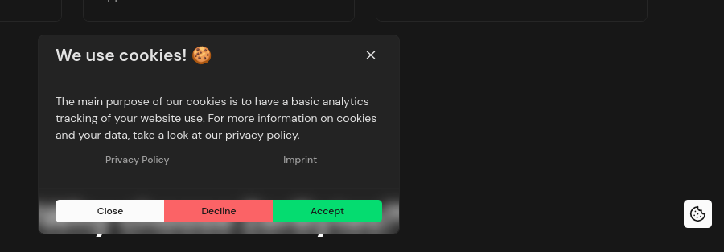

# Nuxt Layer: Cookies

My basic "CookieControl" layer, I mainly use in my projects so I don't have to duplicate the code in every project..

## Requirements

- Nuxt 4+
- Nuxt UI 4+

- _Optional_, You can use [nuxt-i18n](https://github.com/nuxt-modules/i18n) for internationalization of the cookie control component's texts.

## Screenshot



## Examples

### i18n / Custom texts

Pass the localized texts into the component. If the parent recomputes the object when the locale changes, the cookie control updates automatically.

```ts
const cookieControlTexts = computed(() => ({
    title: t('cookieControl.title'),
    subtitle: t('cookieControl.subtitle'),
    description: t('cookieControl.description'),
    clearData: t('cookieControl.clearData'),
    privacyPolicy: t('cookieControl.privacyPolicy'),
    imprint: t('cookieControl.imprint'),
    close: t('cookieControl.close'),
    reject: t('cookieControl.reject'),
    accept: t('cookieControl.accept'),
}));
```

```vue
<CookieControl :texts="cookieControlTexts" />
```
